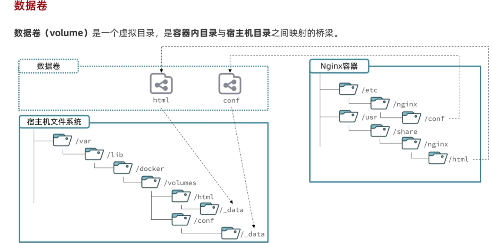
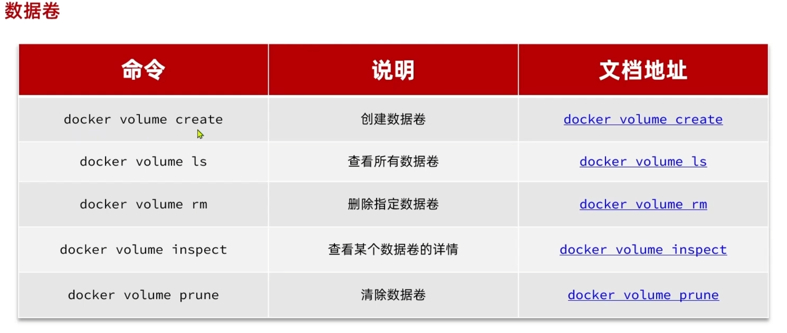
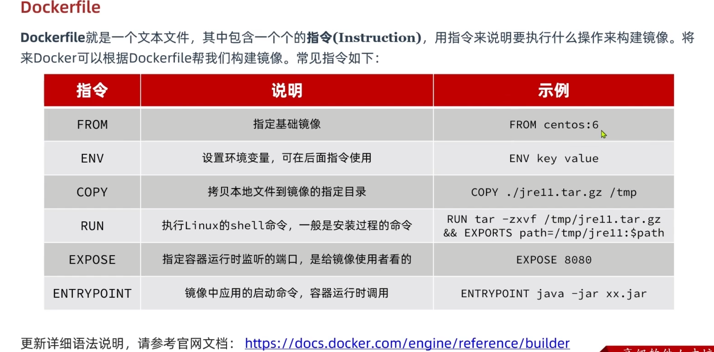
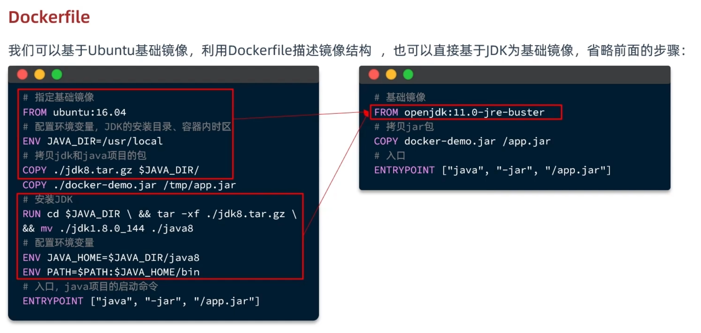
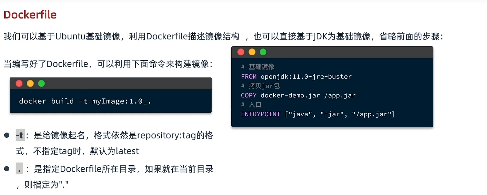
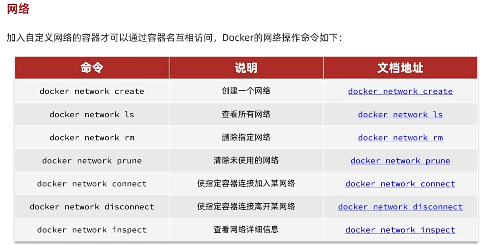
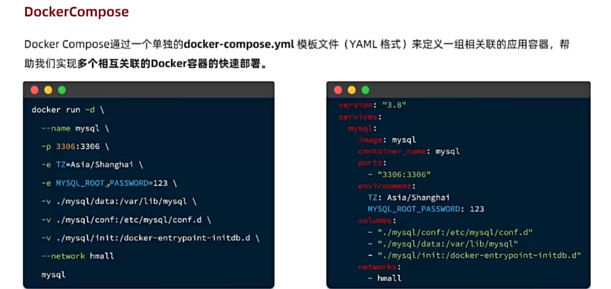
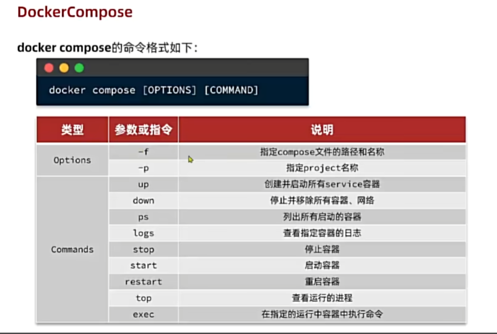

# Docker
[wsl部署教程](https://www.cnblogs.com/wswind/p/16043937.html)


docker load -i 镜像名字

<br >
<br >
<br >

### 指令
```
docker run -d --name nginx -p 5555:80 -v []:[] -e [] --network [] nginx
```
- -d 后台模式
- --name 容器名字
- -p 端口映射
- -v 数据卷
- -e 环境变量
- --network 加入的网路名称
- 镜像名字


<br >
<br >
<br >

### 进入内部容器
```
docker exec -it 容器名 bash
```
> bash表示命令行的方式


<br >
<br >
<br >
 
 ### 数据卷(volome)
 是一个虚拟目录，是容器内目录与宿主目录之间映射的桥梁



- 在docker run命令时，使用  -v 数据卷名（本地目录——以/开头）:容器内目录 可以完成数据卷挂载
- 当创建容器时，如果挂载了数据卷且数据卷不存在，会自动创建数据卷

数据类型需要挂载出来以防备用


##### 操作指令



### Docker 构建镜像
分层(layer)构建
Dockerfile





### 网络互联



### DockerCompose




### apt 

```
步骤 1. 在我们安装任何软件之前，通过apt在终端中运行以下命令来确保您的系统是最新的很重要：

sudo apt update
sudo apt upgrade
sudo apt install build-essential curl gnupg2
```


# wsl 配置
.wslconfig文件配置成镜像模式无法本机访问docker的容器，没有ip

普通模式能访问但不能使用本机代理，无法访问外网